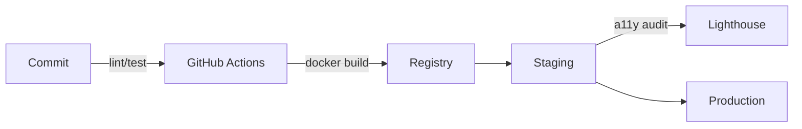

<!-- =========================== HEADER =========================== -->
<h1 align="center">Hi there, I'm Owarino 👋 / Salut, moi c'est Owarino 👋</h1>

  <em>Full-stack • Accessibility advocate • CI/CD & AI automation lover</em> 
  <em>Full-stack • Défenseur de l'accessibilité • Passionné CI/CD & automatisation IA</em> 
  <code>#Symfony #Flutter #Qt6 #UnrealEngine #AI #DevOps #RGAA</code>

  
  
  

---

## 🇬🇧 About Me / 🇫🇷 À propos

🇬🇧 <strong>English Version</strong>

- 🏗️ **Junior Software Architect** focused on industrialization, performance & security  
- ♿ **Accessibility Expert**: Automated RGAA/WCAG audits, inclusive design systems  
- ⚙️ **DevOps**: GitHub Actions, Docker, Kubernetes, IaC (Ansible, Terraform)  
- 🤖 **Advanced AI**: RAG/CAG, vector databases, automated documentation & testing  
- 🎮 **3D/Game Development**: Unreal Engine 5, C++ gameplay, automated pipelines  
- 🌐 **Web/Mobile Development**: Symfony 7, Next.js 15, Flutter 3, Qt6, Tailwind, Spectre.css  

🇫🇷 <strong>Version Française</strong>

- 🏗️ **Architecte logiciel junior** orienté industrialisation, performance & sécurité  
- ♿ **Expert Accessibilité** : audits RGAA/WCAG automatisés, design system inclusif  
- ⚙️ **DevOps** : GitHub Actions, Docker, Kubernetes, IaC (Ansible, Terraform)  
- 🤖 **IA avancée** : RAG/CAG, vector DB, génération de doc & tests automatisés  
- 🎮 **Développement 3D/Jeux** : Unreal Engine 5, C++ gameplay, pipelines automatisés  
- 🌐 **Développement Web/Mobile** : Symfony 7, Next.js 15, Flutter 3, Qt6, Tailwind, Spectre.css  

---

## 🧰 Toolbox

| Back-end | Front / UI | Mobile / Desktop | DevOps | Testing & Quality |
|----------|------------|------------------|--------|-------------------|
| |||||
| |||||
| |||||

---

## 🚀 Featured Projects / Projets Phares

### � ZombieSeasons

*🇬🇧 Co-op FPS vs waves of zombies with procedural seasons*  
*🇫🇷 FPS coopératif contre des vagues de zombies, saisons procédurales*

---

### 🎫 TicketApi

*🇬🇧 Secure micro-service for ticketing with full test coverage*  
*🇫🇷 Micro-service sécurisé de billetterie avec couverture de tests complète*

---

### 📱 flutter-ai-universe

*🇬🇧 Mobile showcase of AI models with on-device chat*  
*🇫🇷 Vitrine mobile de modèles IA avec chat intégré*

---

### 🛒 ECommerceAI

*🇬🇧 Headless shop POC with RAG-powered recommendations*  
*🇫🇷 POC boutique headless avec recommandations RAG*

---

### 💻 CodingInC

*🇬🇧 42-topic curriculum + 11 projects with comprehensive documentation*  
*🇫🇷 Curriculum 42 sujets + 11 projets avec documentation complète*

---

### ✅ checklist

*🇬🇧 Project QA checklist app with automated accessibility reports*  
*🇫🇷 App checklist QA projet avec rapports accessibilité automatisés*

*🇬🇧 See all **23 repositories** → <https://github.com/Owarino?tab=repositories>*  
*🇫🇷 Voir l'ensemble des **23 dépôts** → <https://github.com/Owarino?tab=repositories>*

---

## 🛠️ Automation & CI/CD / Automatisation & CI/CD

🇬🇧 **100% automated**: tests, builds, RGAA audits, SBOM, CVE scanning.  
🇫🇷 **100% automatisé** : tests, builds, audits RGAA, SBOM, scan CVE.

---

🇬🇧 Auto-generated README: daily updates via GitHub Actions (metrics-powered-README, Platane/snk).  
🇫🇷 README auto-généré : mise-à-jour quotidienne via GitHub Actions (metrics-powered-README, Platane/snk).
