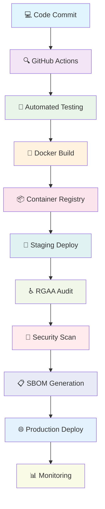

# 🌟 Owarino - Full-Stack Architect & AI Automation Specialist

<div align="center">
  
  

  

</div>

## 🚀 About Me

<div align="center">
  <table>
    <tr>
      <td width="50%">
        
### 🇬🇧 English Version
        
🏗️ **Junior Software Architect** focused on industrialization, performance & security  
♿ **Accessibility Expert**: Automated RGAA/WCAG audits, inclusive design systems  
⚙️ **DevOps**: GitHub Actions, Docker, Kubernetes, IaC (Ansible, Terraform)  
🤖 **Advanced AI**: RAG/CAG, vector databases, automated documentation & testing  
🎮 **3D/Game Development**: Unreal Engine 5, C++ gameplay, automated pipelines  
🌐 **Web/Mobile Development**: Symfony 7, Next.js 15, Flutter 3, Qt6, Tailwind

      </td>
      <td width="50%">
        
### 🇫🇷 Version Française
        
🏗️ **Architecte logiciel junior** orienté industrialisation, performance & sécurité  
♿ **Expert Accessibilité** : audits RGAA/WCAG automatisés, design system inclusif  
⚙️ **DevOps** : GitHub Actions, Docker, Kubernetes, IaC (Ansible, Terraform)  
🤖 **IA avancée** : RAG/CAG, vector DB, génération de doc & tests automatisés  
🎮 **Développement 3D/Jeux** : Unreal Engine 5, C++ gameplay, pipelines automatisés  
🌐 **Développement Web/Mobile** : Symfony 7, Next.js 15, Flutter 3, Qt6, Tailwind

      </td>
    </tr>
  </table>
</div>

---

## 🛠️ Tech Arsenal

<div align="center">
  
  

</div>

<details>
<summary>🔧 <strong>Detailed Tech Stack</strong></summary>

### 🎯 Backend Mastery
```
PHP 8.3 + Symfony 7    ████████████████████ 95%
Rust                   ██████████████████   85%
Node.js                ███████████████████  90%
```

### 🎨 Frontend Excellence
```
Next.js 15             ████████████████████ 95%
Vue/Nuxt 3            ███████████████████  90%
Astro                  ██████████████████   85%
```

### 📱 Mobile & Desktop
```
Flutter 3              ████████████████████ 95%
Qt6                    ███████████████████  90%
Unreal Engine 5        ██████████████████   85%
```

### ⚙️ DevOps & Infrastructure
```
GitHub Actions         ████████████████████ 95%
Docker & Kubernetes    ███████████████████  90%
Ansible & Terraform    ██████████████████   85%
```

</details>

---

## 🌟 Featured Projects

<div align="center">

### 🎮 ZombieSeasons
[](https://github.com/Owarino/ZombieSeasons)


**🇬🇧** Co-op FPS vs waves of zombies with procedural seasons  
**🇫🇷** FPS coopératif contre des vagues de zombies, saisons procédurales

`C++` `Unreal Engine 5` `AI Behavior Trees` `Procedural Generation`

---

### 🎫 TicketApi
[](https://github.com/Owarino/TicketApi)


**🇬🇧** Secure micro-service for ticketing with full test coverage  
**🇫🇷** Micro-service sécurisé de billetterie avec couverture de tests complète

`PHP 8.3` `Symfony 7` `API Platform` `JWT` `PHPUnit`

---

### 🌐 PortFolio2
[](https://github.com/Owarino/PortFolio2)


**🇬🇧** Modern portfolio website built with Astro framework  
**🇫🇷** Site portfolio moderne construit avec le framework Astro

`Astro` `TypeScript` `Tailwind CSS` `GSAP` `Performance Optimized`

---

### 📱 flutter-ai-universe
[](https://github.com/Owarino/flutter-ai-universe)


**🇬🇧** Mobile showcase of AI models with on-device chat  
**🇫🇷** Vitrine mobile de modèles IA avec chat intégré

`Flutter 3` `Dart` `TensorFlow Lite` `On-device AI` `Material Design`

---

### 🛒 ECommerceAI
[](https://github.com/Owarino/ECommerceAI)


**🇬🇧** Headless shop POC with RAG-powered recommendations  
**🇫🇷** POC boutique headless avec recommandations RAG

`Next.js 15` `LangChain` `Vector DB` `RAG` `Stripe Integration`

---

### ✅ checklist
[](https://github.com/Owarino/checklist)


**🇬🇧** Project QA checklist app with automated accessibility reports  
**🇫🇷** App checklist QA projet avec rapports accessibilité automatisés

`Symfony` `RGAA 4.1` `WCAG 2.1` `Automated Testing` `Accessibility`

</div>

---

## 📊 GitHub Analytics

<div align="center">
  
  
</div>

<div align="center">
  
</div>

<div align="center">
  
</div>

---

## 🔄 DevOps & Automation Pipeline

<div align="center">



</div>

### 🛡️ Quality Gates
- ✅ **100% Automated Testing**: Unit, Integration, E2E
- ♿ **RGAA 4.1 Compliance**: Automated accessibility audits
- 🔒 **Security First**: CVE scanning, SBOM generation
- 📊 **Performance Monitoring**: Lighthouse CI, Core Web Vitals
- 🐳 **Containerized**: Docker multi-stage builds
- 🚀 **Zero-downtime**: Blue-green deployments

---

## 🏆 Achievements & Certifications

<div align="center">
  
  
  
  

</div>

### 🎯 Specializations
- 🏗️ **Software Architecture**: Domain-driven design, SOLID principles
- ♿ **Accessibility Expert**: RGAA 4.1, WCAG 2.1 AA certified
- 🤖 **AI Integration**: RAG, vector databases, automated workflows
- 🎮 **Game Development**: Unreal Engine 5, C++ gameplay programming
- 📱 **Cross-platform**: Flutter, Qt6, responsive design

---

## 💡 Fun Facts

<div align="center">
  
  🌍 **Based in**: Rennes, Brittany, France  
  🎯 **Current Focus**: AI-powered development tools  
  ☕ **Fuel**: Coffee + Clean Code  
  🎮 **Gaming**: Unreal Engine 5 enthusiast  
  🌱 **Learning**: Advanced Rust & WebAssembly  
  💬 **Languages**: French (native), English (fluent)

</div>

---

<div align="center">
  
  
  
  **⭐ Star my repositories if you find them useful!**
  
  <sub>🤖 This README is automatically updated daily via GitHub Actions</sub>
  
</div>
