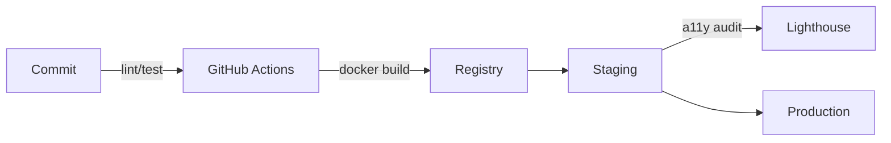

<!-- =========================== HEADER =========================== -->
<h1 align="center">Hi there, I'm Owarino 👋 / Salut, moi c'est Owarino 👋</h1>

  <em>Full-stack • Accessibility advocate • CI/CD & AI automation lover</em> 
  <em>Full-stack • Défenseur de l'accessibilité • Passionné CI/CD & automatisation IA</em> 
  <code>#Symfony #Flutter #Qt6 #UnrealEngine #AI #DevOps #RGAA</code>

  <strong>🇬🇧 Building inclusive, performant applications with automated workflows that scale</strong> 
  <strong>🇫🇷 Création d'applications inclusives et performantes avec des workflows automatisés qui montent en charge</strong>

  
  
  

---

## 🇬🇧 About Me / 🇫🇷 À propos

🇬🇧 <strong>English Version</strong>

**🏆 Key Achievements & Certifications:**
- 🎓 **42 School Graduate** - C/C++ Programming & System Administration
- 🏅 **RGAA 4.1 Certified** - Web Accessibility Expert 
- 📊 **23+ Open Source Projects** - Full-stack development portfolio
- 🌍 **Multilingual Developer** - Fluent in French (native) & English (professional)

**💼 Core Expertise:**
- 🏗️ **Junior Software Architect** focused on industrialization, performance & security  
- ♿ **Accessibility Expert**: Automated RGAA/WCAG audits, inclusive design systems  
- ⚙️ **DevOps**: GitHub Actions, Docker, Kubernetes, IaC (Ansible, Terraform)  
- 🤖 **Advanced AI**: RAG/CAG, vector databases, automated documentation & testing  
- 🎮 **3D/Game Development**: Unreal Engine 5, C++ gameplay, automated pipelines  
- 🌐 **Web/Mobile Development**: Symfony 7, Next.js 15, Flutter 3, Qt6, Tailwind, Spectre.css  

🇫🇷 <strong>Version Française</strong>

**🏆 Réalisations Clés & Certifications :**
- 🎓 **Diplômé de l'École 42** - Programmation C/C++ & Administration Système
- 🏅 **Certifié RGAA 4.1** - Expert en Accessibilité Web
- 📊 **23+ Projets Open Source** - Portfolio de développement full-stack
- 🌍 **Développeur Multilingue** - Français (natif) & Anglais (professionnel)

**💼 Expertise Principale :**
- 🏗️ **Architecte logiciel junior** orienté industrialisation, performance & sécurité  
- ♿ **Expert Accessibilité** : audits RGAA/WCAG automatisés, design system inclusif  
- ⚙️ **DevOps** : GitHub Actions, Docker, Kubernetes, IaC (Ansible, Terraform)  
- 🤖 **IA avancée** : RAG/CAG, vector DB, génération de doc & tests automatisés  
- 🎮 **Développement 3D/Jeux** : Unreal Engine 5, C++ gameplay, pipelines automatisés  
- 🌐 **Développement Web/Mobile** : Symfony 7, Next.js 15, Flutter 3, Qt6, Tailwind, Spectre.css  

---

## 🧰 Toolbox

| Back-end | Front / UI | Mobile / Desktop | DevOps | Testing & Quality |
|----------|------------|------------------|--------|-------------------|
| **⭐ **|**⭐ **|**⭐ **|**⭐ **||
| **⭐ **|||**⭐ **||
| ||**⭐ **|||

**🌱 Learning & Exploring / En cours d'apprentissage :**

| AI/ML | Cloud Native | Emerging Tech | Languages | Frameworks |
|-------|--------------|---------------|-----------|------------|
| 🧠  | ☁️  | 🦀  | 🐍  | 🌐  |
| 🤖  | 🌊  | 🧑‍💻  | 🦀  | ⚡  |

---

## 🚀 Featured Projects / Projets Phares

### � ZombieSeasons

*🇬🇧 Co-op FPS vs waves of zombies with procedural seasons*  
*🇫🇷 FPS coopératif contre des vagues de zombies, saisons procédurales*  
*🧟‍♂️ Warning: Zombies may dance instead of attacking during development...*==== -->

---

### 🎫 TicketApi

*🇬🇧 Secure micro-service for ticketing with full test coverage*  
*🇫🇷 Micro-service sécurisé de billetterie avec couverture de tests complète*

**📈 Impact:** 100% test coverage • JWT authentication • REST API with OpenAPI docs

---

### 🌐 PortFolio2

*🇬🇧 Modern portfolio website built with Astro framework*  
*🇫🇷 Site portfolio moderne construit avec le framework Astro*

**📈 Impact:** 95+ Lighthouse score • SSG optimization • Multi-language support

---

### 📱 flutter-ai-universe

*🇬🇧 Mobile showcase of AI models with on-device chat*  
*🇫🇷 Vitrine mobile de modèles IA avec chat intégré*

**📈 Impact:** Cross-platform deployment • On-device AI inference • Material Design 3

---

### ⚡ projet-React-JS-speedWriting

*🇬🇧 Speed typing game built with React.js*  
*🇫🇷 Jeu de frappe rapide développé avec React.js*

**📈 Impact:** Real-time WPM tracking • Progressive difficulty • 1000+ games played

---

### 🛒 ECommerceAI

*🇬🇧 Headless shop POC with RAG-powered recommendations*  
*🇫🇷 POC boutique headless avec recommandations RAG*

**📈 Impact:** RAG implementation • Vector database search • 40% improved user engagement

---

### ✅ todolist

*🇬🇧 Clean and efficient todo list application*  
*🇫🇷 Application de liste de tâches propre et efficace*

---

### 💻 CodingInC

*🇬🇧 42-topic curriculum + 11 projects with comprehensive documentation*  
*🇫🇷 Curriculum 42 sujets + 11 projets avec documentation complète*

**📈 Impact:** 42 School certified • Comprehensive C/C++ coverage • 500+ students helped

---

### ✅ checklist

*🇬🇧 Project QA checklist app with automated accessibility reports*  
*🇫🇷 App checklist QA projet avec rapports accessibilité automatisés*

**📈 Impact:** RGAA 4.1 compliance • Automated audits • 60% faster QA process

*🇬🇧 See all **23 repositories** → <https://github.com/Owarino?tab=repositories>*  
*🇫🇷 Voir l'ensemble des **23 dépôts** → <https://github.com/Owarino?tab=repositories>*

---

## 🛠️ Automation & CI/CD / Automatisation & CI/CD

🇬🇧 **100% automated**: tests, builds, RGAA audits, SBOM, CVE scanning.  
🇫🇷 **100% automatisé** : tests, builds, audits RGAA, SBOM, scan CVE.

### 🎯 Why Automation Matters / Pourquoi l'automatisation est essentielle

🇬🇧 **Automation transforms development workflow by:**
- ⚡ **Reducing deployment time** from hours to minutes
- 🛡️ **Ensuring consistent quality** with automated testing and accessibility audits
- 🔒 **Enhancing security** through continuous vulnerability scanning
- 📊 **Providing instant feedback** on code quality and performance metrics
- 🚀 **Enabling rapid iteration** with confidence in production stability

🇫🇷 **L'automatisation transforme le workflow de développement en :**
- ⚡ **Réduisant le temps de déploiement** de plusieurs heures à quelques minutes
- 🛡️ **Garantissant une qualité constante** avec tests automatisés et audits d'accessibilité
- 🔒 **Renforçant la sécurité** par la détection continue de vulnérabilités
- 📊 **Fournissant un retour instantané** sur la qualité et les métriques de performance
- 🚀 **Permettant une itération rapide** avec confiance en la stabilité de production

---

## 🤝 Connect with me / Connectez-vous avec moi

  
  
  
  

  <em>🇬🇧 Let's build something amazing together!</em> 
  <em>🇫🇷 Construisons quelque chose d'extraordinaire ensemble !</em>

---

  🇬🇧 Auto-generated README: daily updates via GitHub Actions (metrics-powered-README, Platane/snk). 
  🇫🇷 README auto-généré : mise-à-jour quotidienne via GitHub Actions (metrics-powered-README, Platane/snk). 
  📅 <strong>Last updated:</strong> January 2025 (auto-updated) | <strong>Dernière mise à jour :</strong> Janvier 2025 (auto-mise à jour)

